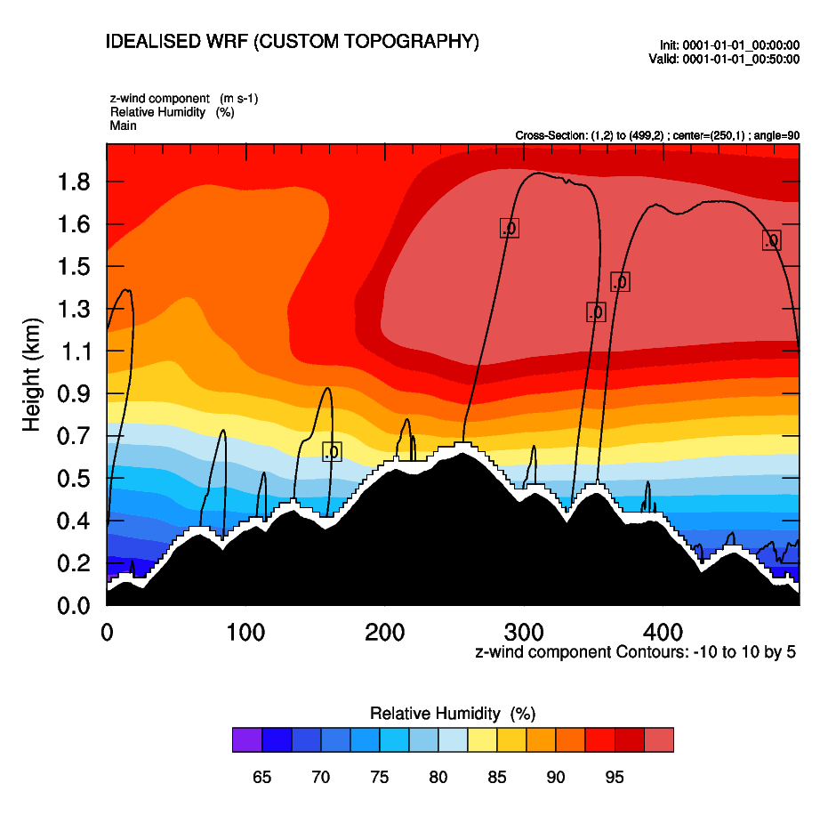

# WRF-2dhill

Modifcations made to the WRF model to enable it to run 2d idealised hill simulations with custom topography data.

The Fortran code in this repo is added to the ``WRF/dyn_em/module_initialize_hill2d_x.F`` file in the WRF codebase. (e.g. https://github.com/dvalters/WRF)

